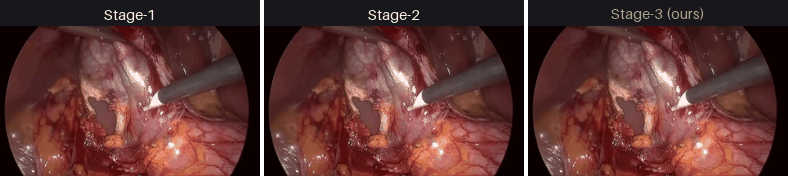
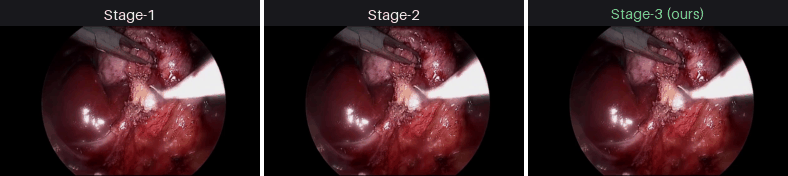
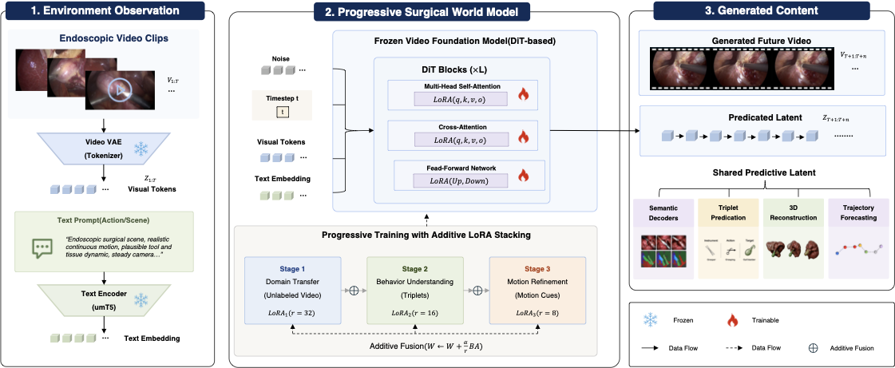
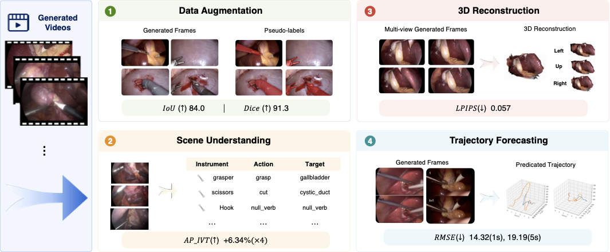
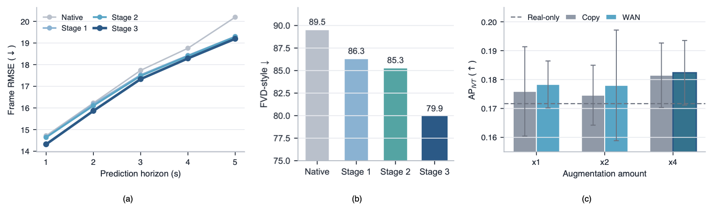

<div align="center">

# SurgGenesis: A Generative Surgical World Model for Future-Aware Surgical Understanding

**A forgetting-resistant surgical world model that rolls current endoscopic observations forward into plausible future frames — built by three-stage progressive adaptation of WAN2.2-TI2V-5B**

[](LICENSE)
[](https://www.python.org/)
[](https://github.com/Wan-Video)
[](https://github.com/modelscope/DiffSynth-Studio)

</div>

<div align="center">
  
  <br/>
  <em>Conditioned future-frame prediction on Cholec80. Left→right: Stage-1 · Stage-2 · Stage-3.</em>
</div>

---

## TL;DR

**SurgGenesis** is a generative surgical **world model**: given a few seconds of endoscopic observation it predicts the *future* of the surgery as video, a step toward future-aware surgical understanding. We adapt **WAN2.2-TI2V-5B** to the surgical domain with a three-stage progressive recipe designed to limit catastrophic forgetting. Its core idea is **Additive LoRA Stacking** — each stage permanently fuses the previous stage's LoRA delta into the base weights before injecting a new, smaller LoRA — combined with **data replay**, **text-distribution harmonization**, **block-restricted LoRA**, and a **decaying learning-rate schedule**.

> **Headline result:** with corrected stage labels, Stage-3 achieves the best reported distribution realism (**FVD: 89.5 → 79.9**, lower is better) and the lowest frame RMSE across the measured 1--5 s prediction horizons.

---

## Table of Contents

- [Highlights](#highlights)
- [Demos](#demos)
- [Method](#method)
- [Results](#results)
- [Repository Structure](#repository-structure)
- [Installation](#installation)
- [Data Preparation](#data-preparation)
- [Training](#training-three-stages)
- [Evaluation](#evaluation)
- [Reproducing the Paper Figures](#reproducing-the-paper-figures)
- [Acknowledgements](#acknowledgements)
- [License](#license)

---

## Highlights

- 🧱 **Additive LoRA Stacking** — *fuse, don't replace*. Prior-stage knowledge is baked into the base weights permanently, so a new LoRA never overwrites it. At inference you load a single Stage-N checkpoint that already contains all prior stages.
- 🔁 **Data replay** — 20% of Stage-2/3 batches are drawn from Stage-1 (Cholec80) data, anchoring the base surgical capability.
- 📝 **Text-distribution harmonization** — an `"Endoscopic surgical scene."` prefix bridges the gap between Stage-1's fixed prompt and the structured triplet/trajectory prompts of later stages.
- 🪜 **Progressive capacity reduction** — LoRA rank `32 → 16 → 8` over the last `30 → 20 → 10` transformer blocks, with learning rate `5e-5 → 5e-6 → 2e-6`.
- 📊 **Dual evaluation** — general video quality (VBench, FVD, temporal-horizon RMSE) *and* a domain-specific surgical-tool segmentation probe (Dice / IoU / Boundary-F1 via a SAM adapter).
- 🔬 **World-model diagnostics** — a *Prediction-Gap / GT-latent upper-bound* analysis and a *latent-stage ablation* that isolate how much of the residual error is model-limited vs. tokenizer-limited.

---

## Demos

Each strip shows the **same conditioning frames** rolled forward by the three curriculum stages; Stage-3 is highlighted in green. Later stages progressively refine surgical conditioning.

| | |
|---|---|
|  |  |

> Full-resolution `.mp4` clips — including the **base model**, **ground-truth future**, and additional cases — live under [`assets/demo/videos/`](assets/demo/videos/) (`condition`, `ground_truth_future`, `base/stage1/stage2/stage3_generated`).

---

## Method

SurgGenesis progressively adapts a frozen video foundation model while fusing each LoRA update before the next stage. The resulting model predicts future video and a shared latent that supports surgical understanding tasks.

<div align="center">
  <a href="assets/figures/Overview.pdf"></a>
  <br/>
  <em>Overview of the progressive surgical world model. Click to view the PDF.</em>
</div>

| Stage | Dataset | Conditioning | LoRA rank | Target blocks | LR | Steps | Replay |
|------:|---------|--------------|:---------:|:-------------:|:----:|:----:|:------:|
| 1 | Cholec80 | fixed prompt | 32 | all 30 | 5e-5 | 2000 | – |
| 2 | CholecT50 | tool–action–target triplet | 16 | last 20 | 5e-6 | 800 | 20% |
| 3 | CholecTrack20 | tool trajectory | 8 | last 10 | 2e-6 | 500 | 20% |

---

## Results

### Downstream surgical understanding

The predicted videos and shared latent support data augmentation, instrument--action--target recognition, 3D reconstruction, and trajectory forecasting.

<div align="center">
  <a href="assets/figures/daownstream.pdf"></a>
  <br/>
  <em>Generated content can be reused across four downstream surgical tasks. Click to view the PDF.</em>
</div>

### Stage ablation

The reported stage labels follow the corrected training order. Stage-3 delivers the strongest result in the reported comparison: FVD falls from 89.54 for native to 79.95 for Stage-3 (lower is better), and Stage-3 has the lowest frame RMSE over the measured 1--5 s prediction horizons.

<div align="center">
  <a href="assets/figures/ablation.pdf"></a>
  <br/>
  <em>Ablation across prediction error, distribution metrics, and data augmentation. Click to view the PDF.</em>
</div>

---

## Repository Structure

```text
SurgGenesis/
├── .nojekyll                  # serve the static project page without Jekyll processing
├── README.md                  # you are here
├── index.html                 # GitHub Pages project interface
├── LICENSE                    # Apache-2.0
├── CITATION.cff
├── requirements.txt
├── configs/                   # stage{1,2,3}.env + generation.env (all hyperparameters)
├── scripts/                   # numbered, runnable pipeline (00 → 50)
├── src/
│   ├── encode_text/           # T5 text-embedding pipeline + triplet prompt builders
│   ├── finetune/              # three-stage trainer (additive LoRA, replay, block-restriction)
│   ├── eval/                  # three-stage generation, mask eval, prediction-gap, horizon
│   ├── video_generation/      # WAN world-model DiT, dataset I/O, long-video continuation
│   └── common/
├── assets/
│   ├── demo/{gifs,videos}/    # curated comparison GIFs + full-res mp4 clips
│   └── figures/               # overview, downstream, and diagnostic figures
├── static/
│   ├── css/index.css           # project-page styling
│   └── js/index.js             # interactive video comparison and citation controls
└── results/metrics/           # runtime metric outputs (not committed)
```

---

## Installation

```bash
git clone <your-fork-url> SurgGenesis
cd SurgGenesis

# Python 3.10+, CUDA 12.x, an Ampere+ GPU (training used 2× A100-40GB)
python -m venv .venv && source .venv/bin/activate
pip install -r requirements.txt
```

You also need the two upstream codebases that this project builds on:

- **[WAN2.2 / Wan2.1 backbone](https://github.com/Wan-Video)** — the `wan` package imported throughout `src/`.
- **[DiffSynth-Studio](https://github.com/modelscope/DiffSynth-Studio)** — the LoRA trainer for WAN2.2-TI2V-5B.

and the **WAN2.2-TI2V-5B** base weights (place them somewhere and point `CKPT_DIR` to it in the configs).

---

## Data Preparation

Three public laparoscopic-cholecystectomy datasets are used (access requires application to the respective owners — see [CAMMA, U. Strasbourg](https://www.camma.u-strasbg.fr/)):

| Stage | Dataset | Role |
|------:|---------|------|
| 1 | **Cholec80** | base video quality; also the replay source for Stages 2–3 |
| 2 | **CholecT50** | tool–action–target triplet conditioning |
| 3 | **CholecTrack20** | tool-trajectory conditioning |

Build triplet prompts and pre-compute T5 text embeddings (so the text encoder never runs inside the training loop):

```bash
bash scripts/00_prepare_triplet_prompts.sh
bash scripts/01_encode_text_t5.sh
bash scripts/02_build_triplet_lookup_bank.sh
```

---

## Training (three stages)

All hyperparameters live in [`configs/`](configs/); edit the paths at the top of each `.env` first.

```bash
# run the full curriculum (stage1 → fuse → stage2 → fuse → stage3)
bash scripts/50_train_all_stages.sh

# …or one stage at a time
bash scripts/10_train_stage1.sh          # Cholec80,      rank 32, lr 5e-5, 2000 steps
bash scripts/20_train_stage2.sh          # CholecT50,     rank 16, lr 5e-6,  800 steps, +replay
bash scripts/30_train_stage3_track20.sh  # CholecTrack20, rank  8, lr 2e-6,  500 steps, +replay
```

Additive stacking is controlled by `--frozen_lora_ckpt / --frozen_lora_rank / --frozen_lora_alpha`; replay by `--replay_video_dir / --replay_ratio / --replay_prompt`; block restriction by `--lora_last_n_blocks`. The implementation is `src/finetune/train_diffsynth_wan_ti2v.py`.

---

## Evaluation

```bash
# three-stage generation + VBench + surgical-tool mask metrics
bash scripts/40_eval_three_stage_wan22ti2v.sh

# paper-revision distribution (FVD) + temporal-horizon analysis
bash scripts/42_run_trustworthy_paper_revision_eval.sh

# world-model prediction-gap vs. GT-latent upper bound
bash scripts/43_run_prediction_gap_gt_latent.sh
```

Each evaluation run emits per-case comparison videos (`base/stage1/stage2/stage3_generated.mp4`, `ground_truth_future.mp4`), a `manifest.json`, and metric CSV/JSON dumps.

---

---

## Acknowledgements

Built on [WAN2.2-TI2V-5B](https://github.com/Wan-Video) and [DiffSynth-Studio](https://github.com/modelscope/DiffSynth-Studio). Datasets — **Cholec80**, **CholecT50**, **CholecTrack20** — are courtesy of the [CAMMA research group, University of Strasbourg](https://www.camma.u-strasbg.fr/). We thank their authors for making surgical-video research possible.

---

## License

Code in this repository is released under the **Apache License 2.0** (see [LICENSE](LICENSE)). The base model, upstream frameworks, and surgical datasets remain under **their own respective licenses and data-use agreements** — this license does **not** grant any rights to those assets or to the underlying patient data.
